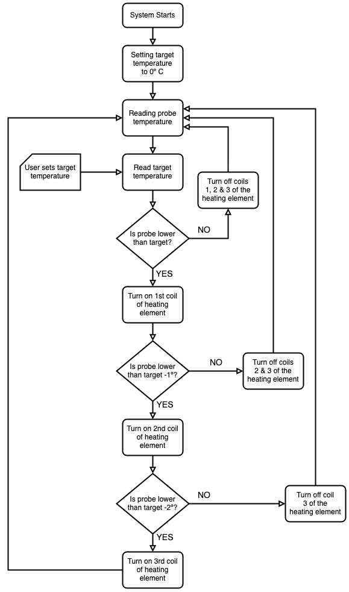

# MashTun_Boiler

Control of a beer mash tun and boiler via a WIFi access point and Async Webserver using an ESP8266 Mini.

The program is an Arduino sketch including the necessary libraries to create an web server on the AP with background image and logo.

The combined mash tun and boiler system consists of a 3 coil heating element and one NTC temperature probe.

## FLOWCHART

